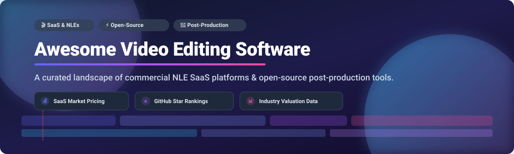

# 🎬 Awesome Video Editing Software & Ecosystem ✂️

> **The definitive SEO-optimized directory of commercial SaaS video editing platforms, professional Non-Linear Editors (NLEs), and top open-source post-production tools.**

**Last updated: October 2026** 📅

---

## 💡 Overview & Market Landscape

This repository tracks notable **SaaS platforms**, **commercial NLEs**, and **open-source video editing projects**. These tools empower creators, filmmakers, and video engineers to cut, arrange, color-grade, compositing, and export video content — ranging from quick social media Reels / TikToks to feature-length cinematic films.

### 🌐 Market Size & Industry Concentration

> 📈 **Market Size & Structure**: The global video editing software market is estimated at **$3.5 Billion in 2026** (projected to reach **$5.2 Billion by 2030** at a ~8.5% CAGR). The commercial desktop NLE & SaaS sector is **moderately concentrated** (dominated by tech giants like **Microsoft**, **Adobe**, **Apple**, **ByteDance**, and **Blackmagic Design**), while the fast-growing creator & AI SaaS space remains **highly fragmented** with specialized online tools competing for micro-content creation.

---

## 📑 Table of Contents

- [💰 SaaS & Commercial NLE Platforms](#-saas--commercial-nle-platforms)
- [⚡ Open-Source GitHub Projects](#-open-source-github-projects)
- [🛠️ Key Frameworks & Libraries](#️-key-frameworks--libraries)
- [🤝 How to Contribute](#-how-to-contribute)
- [⚠️ Disclaimer](#️-disclaimer)

---

## 💰 SaaS & Commercial NLE Platforms

Below is a comparative matrix of leading commercial video editing software, sorted by **Company Size / Valuation / Market Cap (Descending)** 📉.

| 🏢 Product | 🏢 Parent Company / Publisher | 📊 Company Size / Market Cap / Revenue | 💵 Pricing (Starting Tier) | 🎁 Free Tier Limit / Trial | 🎯 Primary Target & Features |
| :--- | :--- | :--- | :--- | :--- | :--- |
| **[Microsoft Clipchamp](https://clipchamp.com/)** | 🟦 Microsoft Corporation | **~$3.1 Trillion** (Market Cap) | **$11.99 / month** (Premium Tier) | **Free Forever Plan**: Exports up to 1080p resolution, watermarks on premium stock assets | Quick web & Windows video editing, AI auto-captioning, templates |
| **[Apple Final Cut Pro](https://www.apple.com/final-cut-pro/)** | 🍎 Apple Inc. | **~$3.0 Trillion** (Market Cap) | **$299.00** (One-time purchase) | **90-Day Free Trial**: Full uninhibited access to all pro features for 90 days | macOS-optimized NLE, Magnetic Timeline, ProRes RAW, M-series chip acceleration |
| **[Adobe Premiere Pro](https://www.adobe.com/products/premiere.html)** | 🔴 Adobe Inc. | **~$220 Billion** (Market Cap) | **$22.99 / month** (Single App Plan) | **7-Day Free Trial**: Full access to all Premiere Pro features for 7 days | Industry-standard timeline NLE, Lumetri color, After Effects integration |
| **[CapCut](https://www.capcut.com/)** | 🎵 ByteDance Ltd. | **~$225 Billion** (Private Valuation) | **$7.99 / month** (CapCut Pro) | **Free Forever Plan**: 720p/1080p exports, 1GB cloud storage, watermarks on Pro AI effects | Mobile/Desktop viral video editor, auto-captions, trending TikTok templates |
| **[DaVinci Resolve](https://www.blackmagicdesign.com/products/davinciresolve)** | 🎨 Blackmagic Design | **~$300 Million** (Annual Revenue) | **$295.00** (DaVinci Resolve Studio one-time) | **Free Forever Plan**: Unlimited resolution up to 4K 60fps, no watermark (excludes Studio GPU effects) | Hollywood-standard color grading, Fairlight audio, Fusion visual effects |
| **[Filmora](https://filmora.wondershare.com/)** | 🔮 Wondershare Technology | **~$1.5 Billion** (Market Cap) | **$49.99 / year** (or $79.99 Lifetime) | **Free Forever Plan**: Full feature access but outputs a mandatory Wondershare watermark | Consumer-friendly NLE, motion tracking, drag-and-drop AI keyframing |
| **[Camtasia](https://www.techsmith.com/camtasia.html)** | 📹 TechSmith Corporation | **~$60 Million** (Annual Revenue) | **$299.99** (Perpetual License) | **30-Day Free Trial**: Full recording & editing capabilities with watermark on exported video | Screen recording, software demos, corporate video training & tutorials |
| **[CyberLink PowerDirector](https://www.cyberlink.com/)** | ⚡ CyberLink Corp. | **~$250 Million** (Market Cap) | **$4.33 / month** ($51.99 billed annually) | **30-Day Free Trial** (PowerDirector Essential): Full features with watermark on output | Fast consumer video editor, 360-degree video editing, AI motion tracking |

---

## ⚡ Open-Source GitHub Projects

Open-source video editing software provides production-grade capabilities without subscriptions or privacy trade-offs. Below are top open-source projects sorted by **GitHub Stars_Count (Descending)** 🌟.

| 📦 Repository & Link | 🌟 GitHub_Stars | ⚖️ License | 🐧 Platform Support | 📝 Description & Key Highlights |
| :--- | :--- | :--- | :--- | :--- |
| **[Blender VSE](https://github.com/blender/blender)** |  | GPL-2.0 | Windows, macOS, Linux | **3D Suite with Built-in Video Sequence Editor (VSE)**. Offers multi-channel audio, masking, compositing, real-time preview, and seamless 3D scene integration. |
| **[Shotcut](https://github.com/mltframework/shotcut)** |  | GPL-3.0 | Windows, macOS, Linux | **Flexible FFmpeg-powered cross-platform NLE**. Supports hundreds of video/audio formats natively, 4K resolution, 3-way color wheels, keyframing, and animated GIFs. |
| **[OpenShot](https://github.com/OpenShot/openshot-qt)** |  | GPL-3.0 | Windows, macOS, Linux | **Beginner-friendly drag-and-drop editor**. Built with Python/Qt, featuring unlimited timeline tracks, 3D animated titles, curve-based keyframe animations, and video masking. |
| **[LosslessCut](https://github.com/mifi/lossless-cut)** |  | GPL-3.0 | Windows, macOS, Linux | **Ultra-fast lossless video & audio trimming tool**. Cuts, slices, and merges video segments without re-encoding, preserving exact original video quality in seconds. |
| **[Kdenlive](https://github.com/KDE/kdenlive)** |  | GPL-2.0 | Windows, macOS, Linux, BSD | **The leading full-featured open-source NLE**. Powered by MLT Framework and KDE. Multi-track editing, proxy workflows for 4K footage, titler, audio scoping, and batch rendering. |
| **[Olive Editor](https://github.com/olive-editor/olive)** |  | GPL-3.0 | Windows, macOS, Linux | **Node-based open-source video editor**. Focuses on node compositing, end-to-end OpenColorIO color management, and high-performance GPU acceleration (Alpha). |
| **[Natron](https://github.com/NatronGitHub/Natron)** |  | GPL-2.0 | Windows, macOS, Linux | **Node-based digital compositing software**. Open-source alternative to After Effects / Nuke for VFX, rotoscoping, keying, and motion graphics pipeline integration. |
| **[VidCutter](https://github.com/ozmartian/vidcutter)** |  | GPL-3.0 | Windows, macOS, Linux | **Simple media cutter and joiner**. Uses FFmpeg and Qt5 for quick frame-accurate SmartCut trimming without quality degradation or re-encoding. |
| **[Flowblade](https://github.com/jliljebl/flowblade)** |  | GPL-3.0 | Linux | **Speed-focused multitrack Linux NLE**. Built with Python and MLT Framework. Features advanced trim tools, magnetic timeline modes, and rich filter pipelines. |
| **[Pitivi](https://github.com/pitivi/pitivi)** |  | LGPL-2.1 | Linux (GNOME) | **Intuitive GNOME-native video editor**. Powered by GStreamer (GES). Designed for clean user interface, seamless desktop integration, and straightforward editing. |
| **[Cap](https://github.com/capway/cap)** |  | AGPL-3.0 | Windows, macOS | **Open-source Loom alternative**. Lightweight screen recorder and quick video clip editor designed for shareable video messages and developer demos. |
| **[Captura](https://github.com/MathewSachin/Captura)** |  | MIT | Windows | **Screen recording and webcam capture tool**. Includes basic trimming, audio mixing, hotkeys, and FFmpeg encoding integration. |

---

### 📂 Additional Open-Source Options & Utilities

- **[Avidemux](https://avidemux.sourceforge.net/)** — Free video editor designed for simple cutting, filtering, and encoding tasks.
- **[LiVES](http://lives-video.com/)** — Video editing and VJ platform for live video performance and multi-track editing.
- **[VapourSynth Editor](https://github.com/Yapsn/vapoursynth-editor)** — Specialized IDE for writing and previewing VapourSynth video processing scripts.
- **[Omniclip](https://github.com/omniclip/omniclip)** — Browser-based open-source video editor rendering via client-side FFmpeg WebAssembly.
- **[Vivia](http://vivia.sourceforge.net/)** — Lightweight NLE with multi-camera editing capabilities for DV streams.

---

## 🛠️ Key Frameworks & Libraries

When building custom video processing or editing software:

- **[MLT Framework](https://github.com/mltframework/mlt)** — Open-source multimedia framework powering Kdenlive and Shotcut.
- **[FFmpeg](https://github.com/FFmpeg/FFmpeg)** — Leading multimedia framework for decoding, encoding, transcoding, muxing, and demuxing.
- **[GStreamer Editing Services (GES)](https://gstreamer.freedesktop.org/)** — High-level library for creating NLE applications on top of GStreamer.
- **[OpenColorIO (OCIO)](https://github.com/AcademySoftwareFoundation/OpenColorIO)** — Complete color management solution tailored for visual effects and animation pipelines.

---

## 🤝 How to Contribute

Contributions are warmly welcomed! Help keep this list updated and comprehensive:

1. Fork this repository.
2. Add your suggested software or update existing entries in `README.md`.
3. Follow the Markdown table formatting and include factual pricing/star details.
4. Open a Pull Request with a clear description of changes.

---

## ❤️ Support & Sponsor

Thank you for visiting and using this project! If you find this curated list of Video Editing Software helpful, please consider supporting the project:

- 🌟 **Star this repository** to help others discover it.
- 🔀 **Fork & Share** it with fellow video creators, developers, and filmmakers.
- ☕ **Buy me a coffee**: Support ongoing maintenance via [GitHub Sponsors](https://github.com/sponsors/ishandutta2007).

---

## 📈 Star History

---

<b>Made with ❤️ for video editors, content creators, filmmakers, and open-source software enthusiasts.</b>

